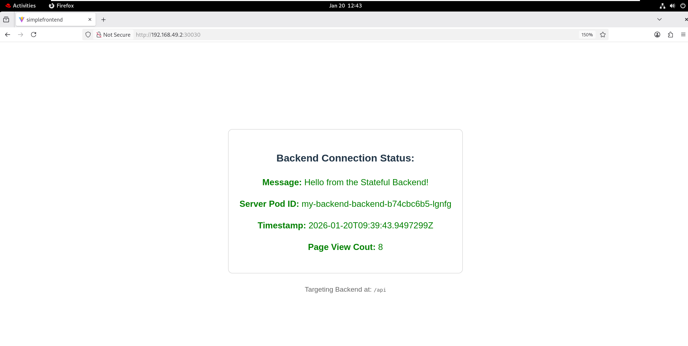

# DevOps Technical Challenge
> Developed by **Ahmed Samy**
---

This repository contains a fully containerized Microservices application (React Frontend + .NET Backend + Redis), orchestrated via Kubernetes (**Helm Charts**), designed with a focus on **persistence, security, and scalability**.

---
## How to Run It (Local Minikube)

Follow these exact commands to spin up the solution on your local cluster.

### Prerequisites
* Docker
* Minikube (Running)
* Helm 3+
* kubectl

### Step 1: Clone & Build Images
First, build the Docker images locally.

```bash
# Build Backend
docker build -t simple-backend:v1 ./SimpleBackend

# Build Frontend
docker build -t simple-frontend:v2 ./SimpleFrontend
```
### Step 2: Load Images into Minikube

```bash
minikube image load simple-backend:v1
minikube image load simple-frontend:v2
```

### Step 3: Deploy with Helm
Modular Helm charts located in the charts/ directory.

```bash
# 1. Deploy Redis (Database)
helm upgrade --install my-redis ./charts/redis

# 2. Deploy Backend (API)
helm upgrade --install my-backend ./charts/backend

# 3. Deploy Frontend (UI)
helm upgrade --install my-frontend ./charts/frontend
```

### Step 4: Access the Application
Run this command in separate terminal and minikube will open browser automatically:
> [!NOTE]
> Target port = 80 && NodePort = 30030
> URL => http://<ip>:30030

```bash
minikube service my-frontend-frontend
```

> [!WARNING]
> If the previous command fails....

# You can access the app via Port Forwarding 
Run this command in separate terminal:

```bash
kubectl port-forward svc/my-frontend-frontend 3000:80
```
This will map localhost:3000 on your machine to the service port 80.
Open your browser at: http://localhost:3000

---

## Persistence Verification (The Test)

1. Open the application from your browser, and refresh the page a few times. Ensure the "Page View Count" increases

<div align="center">
  
</div>

2. Identify the Redis Pod:

```bash
kubectl get pods -l app=my-redis-redis
```

3. Kill the Redis Pod

```bash
kubectl delete pod [REDIS_POD_NAME]
```

4. Verify Persistence:
- Wait for the new Redis pod to be Running (1/1 Ready)
- Go back to your browser and Refresh the page.
- Result: The counter should NOT reset to 1. It should continue incrementing.

---

## Project Structure

.
├── charts/                 # Helm Charts 
│   ├── backend/            
│   ├── frontend/           # React + Nginx Chart
│   └── redis/              # Redis with Persistence Chart
├── SimpleBackend/          # .NET Source Code + Dockerfile
├── SimpleFrontend/         # React Source Code + Dockerfile
├── .github/workflows/      # CI/CD Pipeline (Smart Trigger Logic)

---

## Feedback

Thank you for taking the time to review this technical challenge. 

I am open to any feedback or suggestions for improvement.

📩 **Get in touch:** [LinkedIn Profile](https://www.linkedin.com/in/devopsahmedsmy/)
